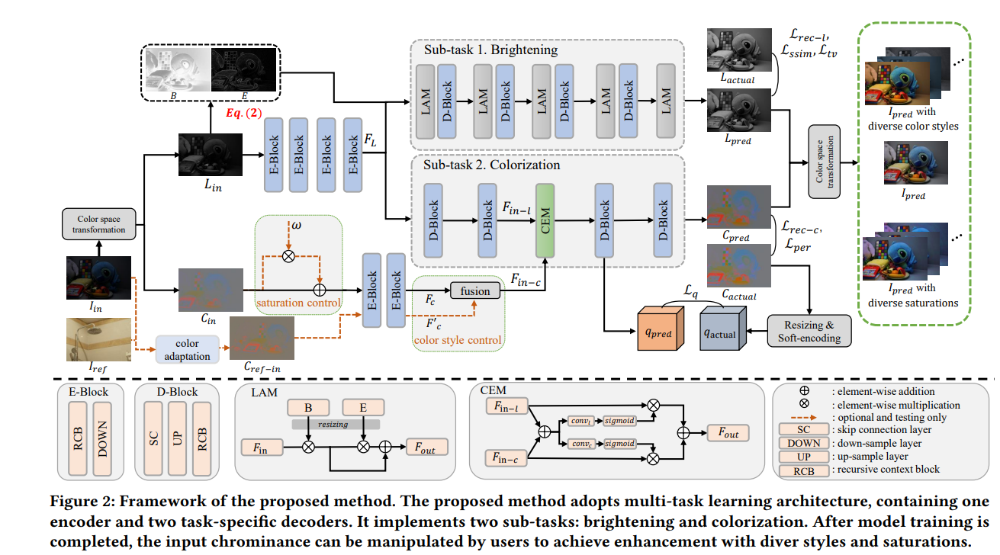

# [Brighten-and-Colorize: A Decoupled Network for Customized Low-Light Image Enhancement](https://arxiv.org/pdf/2308.03029.pdf)
## Introduction

This is the official implementation of "Brighten-and-Colorize: A Decoupled Network for Customized Low-Light Image Enhancement" (ACM MM 2023)



In this work, we exploit the relationship between image enhancement and image colorization, and achieve colorization-inspired customized image enhancement by a decoupled network. Specifically, it decouples the image enhancement into two sub-tasks, brightening and colorization. The brightening sub-task aims to recover the image with normal contrast, less noise, and finer other lightness details. While the colorization sub-task is based on the process of user-guide image colorization. It takes the chrominance of low-quality images as color guidance and aims to predict the rich chrominance of images. Once the model training is finished, the color guidance (i.e., chrominance of low-quality image) can be coarsely manipulated by users to acquire customized results. 

Note that we have extended this work and adopt performance evaluation in LSRW as shown below instead of LOL, which is very easy to overfitted.


## Installation

```
conda create --name BCNet --file requirements.txt
conda activate BCNet
```

## Datasets

- LSRW-Huawei and LSRW-Nikon can be found in [here](https://github.com/JianghaiSCU/R2RNet).

## Run LLIE

For network training, you can modify the dataset path in `./options/train/LSRW_Huawei_lightness.yml` and `./options/train/LSRW_Huawei_lightness.yml`, and run the `sh run.sh`. **Remember delete the experiments folder for each training.**

For evaluation, you can modify the dataset path and model path in `./options/test/LSRW_Huawei.yml`. We have placed the pre-trained models in `./pre-trained` folder.

## Run customization

For convenient running customization process, we build a very simple UI. You can run the `./ui/main.py`. The simple guideline can be seen following figure.


## Citation Information

If you find the project useful, please cite:

```
@inproceedings{conf/mm/WangJ23,
	title = {Brighten-and-Colorize: A Decoupled Network for Customized Low-Light Image Enhancement.},
	year = {2023},
	booktitle = {ACM Multimedia},
	author = {{Chenxi Wang} and {Zhi Jin}},
	publisher = {ACM},
	booktitle = {Proceedings of the 31st ACM International Conference on Multimedia, MM 2023, Ottawa, ON, Canada, 29 October 2023- 3 November 2023}
}
```
